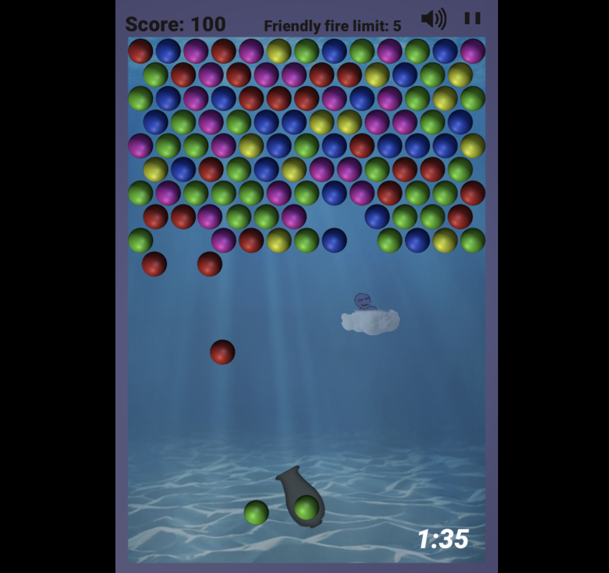
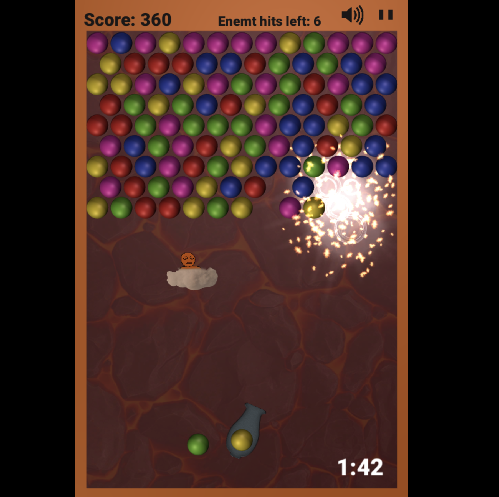

# BubbleShooter

Scripts for a BubbleShooter game creating with Unity.
The game can be played in two modes, Soft mode and Hardcore mode. 

## Soft mode
In the soft mode the enemy have nice comments and bubbles popped will pop like a bubble. The music is relaxing.

## Hardcore mode
In Hardcore mode the enemy have ruff comments, move faster and in an unpredictable mannar, and bubbles popped is exploding. The music is much more heavy and stress full. 
